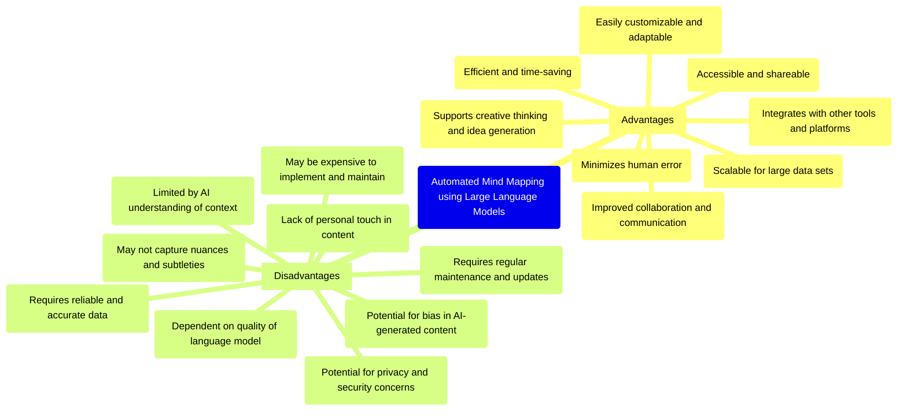

# Automated Mindmapping with GPT and Mermaid

This repository houses a project that enables automatic creation of mindmaps using OpenAI's GPT-3.5-turbo and GPT-4 models, with the support of Mermaid for mindmap visualizations.

## About

The system comes with built-in system prompts for brainstorming, text summarization, and cause/effect visualization. The integration of GPT models provides the power of language understanding, while Mermaid enables rich and customizable visual representations.

What does the project say about advantages and disadvantages of automated mindmapping (note that GitHub doesn't seem to support the icons):



[view at mermaid.live](https://mermaid.live/edit#pako:eNqNVctu20AM_JWFTi0Q_YBvAdJDgBgommPVA7WiJNb7UJZcO26Qfy9XdprYwAY9WJD3MRwOh9RLY-OAzabxFAYPSxc6STHKl665zRI9CA5mq3tmC8tCYTKZy_MB0oT6DFMGfdkqiOOu-Vrud_JTbw97CKJ7uvrrtLrZkI3hywhmhFbm7Htu83K-0pWQ38aRLGEQAxpRyGPLsNd4_5CvUKyLdvcR4dbanJT0CqDnmFgKXkLOTriKM6PdtUPMvcMLQsDkjsZmVi3oD-j2igwDLFL-VQHjxB-B7v2S4h4LJ-egj8qRYjiz9D4HsutKDS8zpgvAx7wsMQkbm1Bv7tHITGFXalNAaUAwEwZMn8I6mmbps-uvNERmesuVZ9AQn-S6HmjByQU_C26Va4zJuNUtAwgYxnoV8HnRgC2kFA98DagmJC0BslHnQDCop1IdyTrwa-qtJFKbXtb1PghOxSdsDiSziTJjMhKj4zXnxYEocc914cLu3ex3xPB_fh_iIXwk8gOfMqk51aCO3u315uIiWY1C2euBL_L6HovbCdwq-5JoD_Z4qiIqJMmxNIXFFLheTUI3XKt_hwuGoXSSuvYpgytQcdTKnieALxOghtknoIu0t3A0IYqx2kY5oQkZlNVJe869OBTCKkUYfmtDfsR7UGuUSdUfze29yco0sShYaQdlqVcFn6WGNzlgRq4L2ROwoaDY7bmn1k4O5Uw1Z_W_5tSyNgJWSj5l7QzjVRxFKqdXAfIyFGfWgA8Jg52v1ezRaPugDrwyCqIhvzj0b6N0DaG_qpfKVEot03RRpgewu6LfonLGoGJIzHYuSrwn39w0HpMGGPQr8tIFY7pGu8nruNjo64Aj6OTtmi686lHQj8rjMdhmIynjTXPK9Y5Au9E3mxEc4-tfWGtgMg)

Please note that GPT-4 access is currently limited to the waitlist, so you would need to have access to use this model in the system.

## Features
- Utilizes GPT-3.5-turbo and GPT-4 models for mindmap generation
- Supports prompts for brainstorming, text summarization, and cause/effect visualizations
- Outputs mindmaps in Mermaid syntax
- Provides a visual representation of mindmaps
- Offers a convenient way to save generated mindmap images

## Known Limitations
- GPT-4 can only be used if you have access.
- The system may sometimes produce inaccurate information due to the current limitations of Large Language Models (LLMs).
- There might be occasional inconsistencies in style.
- Sometimes, the output isn't valid Mermaid syntax (you can then edit the mermaid code under output).
- When saving the image, the Font Awesome icons might look different from what is shown on the screen.
- Due to iOS limitations the text area elements can't be resized

## Prerequisites

Before you begin, ensure you have met the following requirements:

- You have installed the latest version of [Node.js and npm](https://nodejs.org/en/download/).
- You have a recent version of [Yarn](https://classic.yarnpkg.com/en/docs/install) installed.
- You have access to OpenAI's GPT-3.5-turbo or GPT-4 models.

## Getting Started

To start using the project, follow these steps:

1. Clone the repository:
```shell
git clone https://github.com/florian-kalisch/auto-mindmapping.git
```

2. Navigate into the project directory:
```shell
cd auto-mindmapping
```

3. Install the required dependencies using Yarn:
```shell
yarn install
```

3. Start the React development server:
```shell
yarn start
```

Your application should be running on
[localhost:3000/auto-mindmapping](http://localhost:3000/auto-mindmapping)

## Further Reading
Please take a look at the following resources to better understand the project:
- [https://react.dev/](https://react.dev/)
- [OpenAI API](https://platform.openai.com/docs/api-reference/)
- [Mermaid Syntax](https://mermaid.js.org/syntax/mindmap.html)
